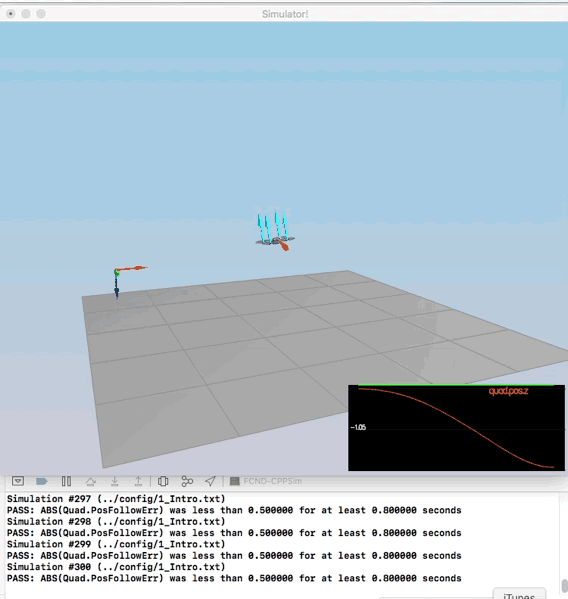
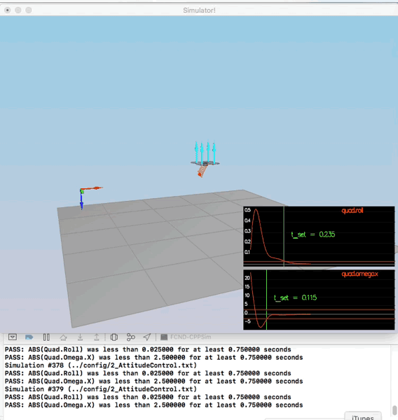
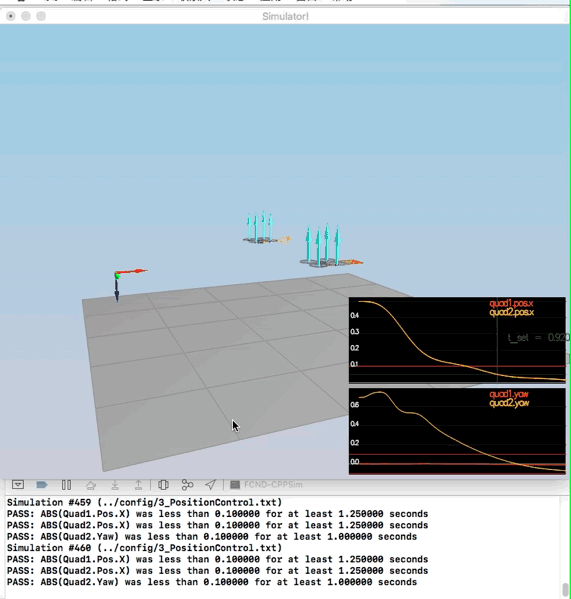
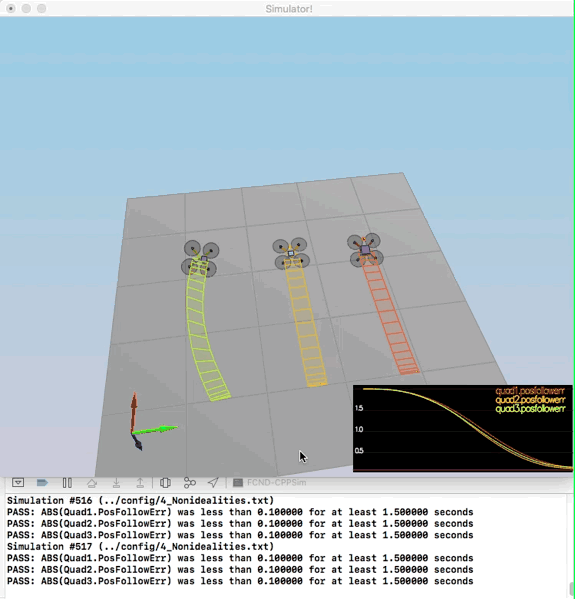
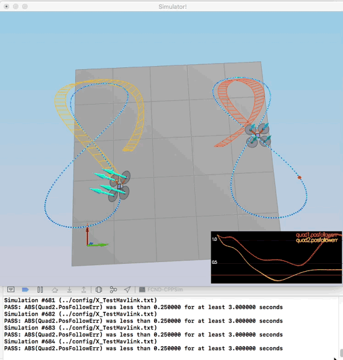

# FCND-Controls-CPP-Solution
## The Controller Tasks in C++ ##

The seed project README.md give guides to run the project and information of the task we need to execute for implementing the controller. There are five scenarios we need to cover. In the five scenarios, tuning parameter ranges and parameter ratios can help the simulator runs in a loop on the current scenario and show on the standard output an indication the scenario pass or not.

All the C++ code is in the /cpp directory. The more interesting files are:

- /cpp/config/QuadControlParams.txt: This file contains the configuration for the controller. While the simulator is running, you can modify this file, and the simulator will "refresh" those parameters on the next loop execution.
- /cpp/src/QuadControl.cpp: This is where all the fun is, but I should not say this because this file contains the implementation of the controller only. Most of the time needed to pass the scenarios is spend on the parameter tuning.

#### Run the code

Following the instruction on the seed project, load the project on the IDE. Remember the code is on /cpp.

#### Scenario 1: Intro

In this scenario, we adjust the mass of the drone in [/cpp/config/QuadControlParams.txt](./config/QuadControlParams.txt)until it hovers for a bit:

When the scenario is passing the test, you should see this line on the standard output:  
```
PASS: ABS(Quad.PosFollowErr) was less than 0.500000 for at least 0.800000 seconds
```



This video is [1_Intro_new.mov](./videos/1_Intro_new.mov)

#### Scenario 2: Body rate and roll/pitch control ####

Next, we will keep track of the moments created by the propellers.   For roll motion, the moments generated by the first and fourth propellers are counteracted by the moment generated by the second and the third propellers. The $l$ is a distance between x-axis and propeller location, which is equal to half of the distance between neighboring propellers. In the same fashion, the pitch is generated by the mismatch of the moments created by first and second propellers and the moment generated by the third and fourth propellers. 

Contrary to the roll and pitch the yaw motion is executed by the mismatch of the moments generated by the propellers along the $z$ axis by the reactive force. The moment generated by the propeller is directed opposite of its rotation and is proportional to the square of the angular velocities.  

$$
\begin{align}
\tau_x &= (F_1 + F_4 - F_2 - F_3)l \\
\tau_y &= (F_1 + F_2 - F_3 - F_4)l \\
\tau_z &= \tau_1 + \tau_2 + \tau_3 + \tau_4
\end{align}
$$

Where $\tau_1 = - k_m \omega^2_1$, $\tau_2 = k_m \omega^2_2$, $\tau_3 = -k_m \omega^2_3$, $\tau_4 = k_m \omega^2_4$. In our notation, the propellers 1 and 3 rotate in clockwise thus producing the moment in the counterclockwise direction with negative sign and propellers 2 and 4 rotate in counterclockwise thus the resulting moments are in opposite and have the positive signs.  


To accomplish this, you will:

1. Implement body rate control

 - implement the code in the function `GenerateMotorCommands()`
 


Now is time to start coding. The [GenerateMotorCommands method](./src/QuadControl.cpp#L56-L93) needs to be coded resolving above equations

- implement the code in the function `BodyRateControl()`

The second step is to implement the [BodyRateControl method](./src/QuadControl.cpp#L95-L121) applying a P controller and the moments of inertia.

 - Tune `kpPQR` in `QuadControlParams.txt` to get the vehicle to stop spinning quickly but not overshoot   
  At this point, the `kpPQR` parameter has to be tuned to stop the drone from flipping. The initial value of kpPQR is 23, 23, 5, you should see the rotation of the vehicle about roll (omega.x) get controlled to 0 in the small screen of the simulator when the value enlarge between two times and four times.
  
   // Angle rate gains   
   kpPQR = 46, 46, 6.0

2. Implement roll / pitch control  

We won't be worrying about yaw just yet.
- implement the code in the function `RollPitchControl()`  
 
Once this is done, we move on to the [RollPitchControl method](./src/QuadControl.cpp#L124-L170). For this implementation, you need to apply a few equations. You need to apply a P controller to the elements `R13` and `R23` of the rotation matrix from body-frame accelerations and world frame accelerations:  


But the problem is you need to output roll and pitch rates; so, there is another equation to apply:


- Tune `kpBank` in `QuadControlParams.txt` to minimize settling time but avoid too much overshoot  
You should also see the vehicle angle (Roll) get controlled to 0.  
// Angle control gains   
kpBank = 12 




When the scenario is passing the test, you should see this line on the standard output:  
```
PASS: ABS(Quad.Roll) was less than 0.025000 for at least 0.750000 seconds
PASS: ABS(Quad.Omega.X) was less than 2.500000 for at least 0.750000 seconds
```

This video is [2_AttitudeControl_new.mov](./videos/2_AttitudeControl_new.mov)

#### Scenario 3: Position/velocity and yaw angle control ###

There are three methods to implement here:

- [AltitudeControl]: This is a [PD controller] to control the acceleration meaning the thrust needed to control the altitude.


Next, you will implement the position, altitude and yaw control for your quad.  For the simulation, you will use `Scenario 3`.  This will create 2 identical quads, one offset from its target point (but initialized with yaw = 0) and second offset from target point but yaw = 45 degrees.

 - implement the code in the function `LateralPositionControl()`   
 [LateralPositionControl](./src/QuadControl.cpp#L218-L280) This is another PID controller to control acceleration on `x` and `y`.

- implement the code in the function `AltitudeControl()`    
[AltitudeControl](./cpp/src/QuadControl.cpp#L171-L215): This is a PD controller to control the acceleration meaning the thrust needed to control the altitude.

- tune parameters `kpPosZ` and `kpPosZ`
- tune parameters `kpVelXY` and `kpVelZ`  

For a second order system, such as the one for this quadcopter, the velocity gain (kpVelXY and kpVelZ) should be at least ~3-4 times greater than the respective position gain (kpPosXY and kpPosZ).  
Position control gains:
kpPosXY = 29.0
kpPosZ = 30.0
KiPosZ = 40

Velocity control gains:
kpVelXY = 12.5
kpVelZ = 30.0

If successful, the quads should be going to their destination points and tracking error should be going down (as shown below). However, one quad remains rotated in yaw.

 - implement the code in the function `YawControl()`  
 [YawControl](./cpp/src/QuadControl.cpp#L282-L318): This is a simpler case because it is P controller. It is better to optimize the yaw to be between `[-pi, pi]`.

 - tune parameters `kpYaw` and the 3rd (z) component of `kpPQR`  
Angle control gains:
kpBank = 10
kpYaw = 2  
Angle rate gains: kpPQR = 46, 46, -3




When the scenario is passing the test, you should see this line on the standard output:     
```
PASS: ABS(Quad1.Pos.X) was less than 0.100000 for at least 1.250000 seconds
PASS: ABS(Quad2.Pos.X) was less than 0.100000 for at least 1.250000 seconds
PASS: ABS(Quad2.Yaw) was less than 0.100000 for at least 1.000000 seconds
```

This video is [3_PositionControl_new.mov](./videos/3_PositionControl_new.mov)

#### Scenario 4: Non-idealities and robustness

- Edit `AltitudeControl()` to add basic integral control to help with the different-mass vehicle.   
we need to add an integral part to the altitude controller to move it from PD to PID controller. At the beginning, the second and third drone can fly pass the test but the first drone according to the step1 to step3 can't pass the test. At this time, I tune the KiPosz=40, then I find the drone can close to the red point and pass the test.



When the scenario is passing the test, you should see this line on the standard output:

```
PASS: ABS(Quad1.PosFollowErr) was less than 0.100000 for at least 1.500000 seconds
PASS: ABS(Quad2.PosFollowErr) was less than 0.100000 for at least 1.500000 seconds
PASS: ABS(Quad3.PosFollowErr) was less than 0.100000 for at least 1.500000 seconds
```

This video is [4_Nonidealities.mov](./videos/4_Nonidealities.mov)

#### Scenario 5: Tracking trajectories

When your drone pass the above test, you may find your drone can pass through this scenario. I didn't tune any parameters at this scenario.


When the scenario is passing the test, you should see this line on the standard output:

```
PASS: ABS(Quad2.PosFollowErr) was less than 0.250000 for at least 3.000000 seconds
```

This video is [5_TrajectoryFollow.mov](./videos/5_TrajectoryFollow.mov)

There are a few optional scenarios on this project. When you done above scenarios, the last two scenarios can easily pass through the test.


This video is [X_TestManyQuads.mov](./videos/X_TestManyQuads.mov)




This video is [X_TestMavlink.mov](./videos/X_TestMavlink.mov)
